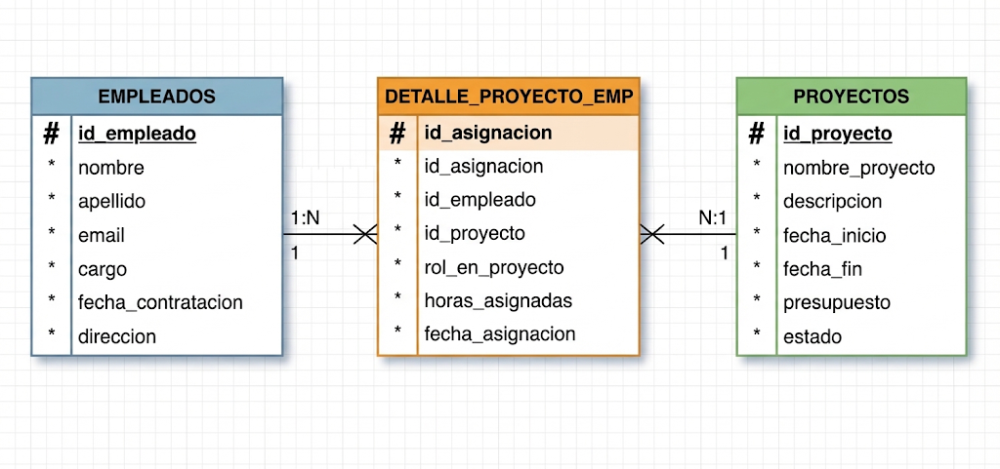

# Proyectos y Empleados

Sistema de gestión integral para el control de proyectos corporativos y administración de personal, desarrollado con una interfaz moderna y minimalista.

## Características Principales
* **Autenticación Moderna:** Vistas de Login, Registro y Recuperación de Contraseña rediseñadas por completo con **Tailwind CSS** (estética de tarjetas limpias, gradientes oscuros y efectos glass-morphism).
* **Panel de Control (Dashboard):** Interfaz centralizada para usuarios autenticados con gestión de sesiones y accesos rápidos al sistema.
* **Diseño UI/UX Uniforme:** Experiencia de usuario coherente en todo el módulo de accesos sin componentes heredados de Bootstrap.

## Stack Tecnológico
* **Backend:** Laravel / PHP 8.3
* **Base de Datos:** mysql
* **Frontend / Estilos:** Tailwind CSS
* **Control de Versiones:** Git y GitHub (`Xt-Andrey/proyectos-empleados.git`)

## Requisitos del Sistema
* PHP >= 8.3
* Composer
* Node.js y NPM
* Git
## MER IMAGEN 



## Estructura y Diseño del Modelo Entidad-Relación (MER)

Para dar solución a la gestión de personal y proyectos dentro de la organización, se diseñó un modelo relacional normalizado que evita redundancias y elimina bucles o relaciones recursivas innecesarias. La arquitectura se compone de tres entidades principales:

EMPLEADOS: Contiene la información personal y laboral de cada trabajador. Su identificador principal es # id_empleado, y almacena atributos descriptivos como el nombre, apellido, correo electrónico, cargo, fecha de contratación y dirección.

PROYECTOS : Agrupa los datos generales asociados a cada iniciativa corporativa mediante la llave primaria # id_proyecto, registrando detalles como el nombre del proyecto, descripción, fechas de inicio y fin, presupuesto y estado actual.    

DETALLE_PROYECTO_EMP (Tabla Intermedia): Diseñada para descomponer la relación de muchos a muchos ($N:M$) original entre empleados y proyectos en dos relaciones limpias de uno a muchos ($1:N$). Posee su propio identificador # id_asignacion, incorpora las llaves foráneas correspondientes y almacena métricas específicas de la vinculación, tales como el rol desempeñado, las horas asignadas y la fecha de asignación.

## 📋 Requisitos del Sistema

### Requisitos Funcionales
* **RF01 - Gestión de Proyectos:** El sistema debe permitir registrar, consultar, actualizar y eliminar proyectos, almacenando su código único, nombre, descripción, fechas de inicio y fin, presupuesto y estado.
* **RF02 - Gestión de Empleados:** El sistema debe permitir administrar el directorio del personal, registrando nombre, apellido, correo electrónico único, cargo, fecha de contratación y dirección.
* **RF03 - Asignación de Recursos:** El sistema debe permitir asociar empleados a proyectos a través de la tabla intermedia, guardando detalles específicos como el rol en el proyecto, las horas asignadas y la fecha de asignación.
* **RF04 - Consulta de Relaciones:** El sistema debe permitir visualizar qué empleados participan en un proyecto determinado, así como los proyectos en los que trabaja un empleado específico.

### Requisitos No Funcionales
* **RNF01 - Integridad de Datos:** La base de datos debe garantizar la integridad referencial mediante el uso de llaves foráneas y restricciones en las migraciones de Laravel.
* **RNF02 - Rendimiento:** Las consultas entre modelos deben optimizarse mediante la carga ansiosa (*eager loading*) de Eloquent para evitar sobrecargas en la base de datos (problema N+1).
* **RNF03 - Arquitectura y Mantenibilidad:** El código backend debe seguir estrictamente el patrón arquitectónico Modelo-Vista-Controlador (MVC) propio de Laravel.
* **RNF04 - Seguridad y Acceso:** El acceso a los módulos de gestión y administración de datos debe estar protegido mediante mecanismos de autenticación y control de rutas.

## Guía de Instalación y Configuración Paso a Paso

1. **Clonar el repositorio:**
   ```bash
   git clone [https://github.com/Xt-Andrey/proyectos-empleados.git](https://github.com/Xt-Andrey/proyectos-empleados.git)
   
2. **Abrir carpeta de proyecto:**
   cd proyectos-empleados
   
4. **Instalar composer:**
   composer install

5. **Intalas npm:**
   npm install
   
   php artisan key:generate

6. **Migrar datos a la base de datos:**
   php artisan migrate
   
7. **Abrir pagina web:**
   ```bash
   composer run dev 

8. **actualizar basse de datos:**
  php artisan migrate